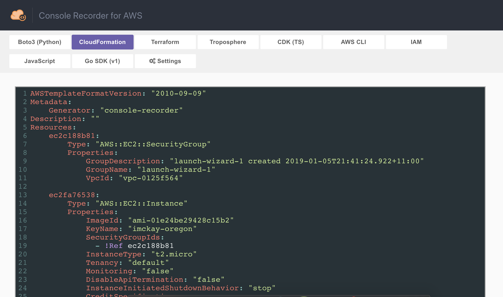
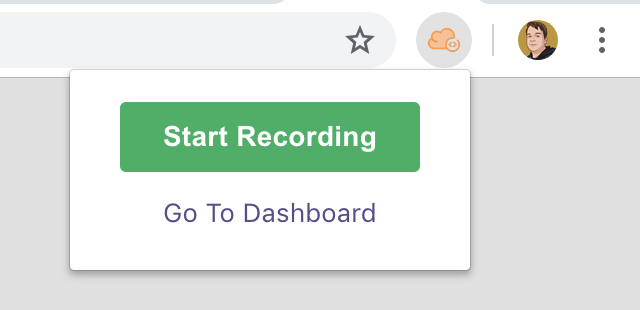

# Console Recorder for AWS

  

> Records actions made in the AWS Management Console and outputs the equivalent CLI/SDK commands and CloudFormation/Terraform templates.

:exclamation: **CAUTION:** This project is currently in beta stages. Some components may not work as expected.

## Installation

### Google Chrome

You can download the extension from the [Chrome Web Store](https://chrome.google.com/webstore/detail/console-recorder/ganlhgooidfbijjidcpkeaohjnkeicba) or load the extension manually via chrome://extensions/.

### Mozilla Firefox

You can download the extension from [Firefox Add-ons](https://addons.mozilla.org/en-GB/firefox/addon/console-recorder/) or load the extension manually via about:addons. If loaded manually, replace the `manifest.json` file with the `firefoxManifest.json` file before loading.

## Usage

Click the orange _Console Recorder for AWS_ icon in the top-right corner of your browser window. If you do not see it, you may find it by clicking the three vertical dots and checking the top row. Once the popup is presented, click the **Start Recording** button.

All supported actions will be recorded up until the point in which you click the icon again and select the **Stop Recording** button, at which point you will be presented with the dashboard for you to copy code from.

The following outputs are currently supported:

* Boto3 (Python) SDK
* AWS CLI (v1)
* JavaScript SDK
* Go SDK (v1)
* CloudFormation
* HashiCorp Terraform
* CDK (TypeScript)

## Settings

In the Settings section, there are a number of options you can set. These options take effect as soon as you change them.

### Block Mutable Requests

This option will stop any mutable requests (most things that aren't a `Get*` or `List*` action) from executing in the console, whilst still logging the generated outputs in the dashboard.

### Intercept Responses

This option will record the response body from all AWS calls. Setting this allows CloudFormation, CDK and Terraform to correlate actions between resources. For example, CloudFormation will use the `!Ref` and `!GetAtt` intrinsic functions to reference resource identifiers within the template.

:warning: **Note:** When Intercept Responses is set in Google Chrome, a notification telling you the extension is debugging the browser is shown for the duration of the recording for security purposes.

## Security

Network data from the AWS Management Console is recorded and information is extracted from the requests and responses. Recording data is kept entirely in memory or on local disk and is never sent over the internet or anywhere else. You should take care to remove any sensitive data (passwords etc.) when sharing your generated code/templates with others.

## Coverage

Not all actions and resources are supported yet, check [this page](https://github.com/iann0036/AWSConsoleRecorderGenerator/blob/master/coverage.md) for an up-to-date overview of supported actions and resources. This page is automatically generated.

## Bugs

Given the nature of the extension, and the frequency in which the AWS team make updates, bugs will be frequent and inevitable. If you find these bugs, check [the issues page](https://github.com/iann0036/AWSConsoleRecorder/issues) to see if it has already been raised and if not, feel free to raise it.
